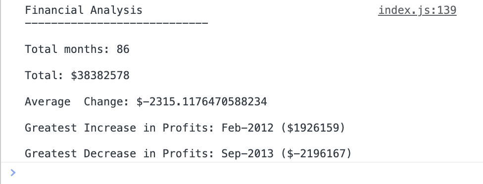

# Console Finances

## Description

We have been given a dataset composed of arrays with two fields: Date and Profit/Losses. This application analyzes the records to calculate each of the following using JavaScript:

  * The total number of months included in the dataset.
  * The net total amount of Profit/Losses over the entire period.
  * The average of the changes in Profit/Losses over the entire period.
  * You will need to track what the total change in profits is from month to month and then find the average.
    * (Total/(Number of months - 1))
  * The greatest increase in profits (date and amount) over the entire period.
  * The greatest decrease in losses (date and amount) over the entire period.

## Demo

The following image shows the web application's appearance and functionality:

Also, You can see the live version of app in the following link:
https://kianamsqt.github.io/Console-Finances/

## Installation

N/A

## Usage

## Credits

N/A

## License

Please refer to the LICENSE in the repo.
